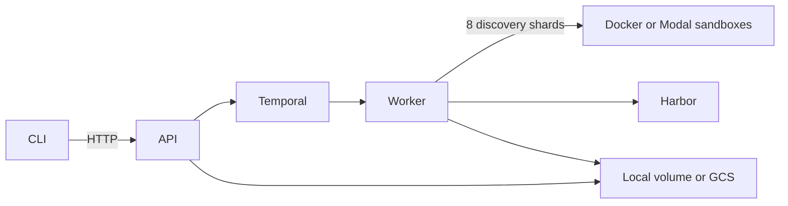

# SelfBench

[](https://github.com/mupt-ai/selfbench/actions/workflows/ci.yml)
[](LICENSE)

SelfBench turns completed GitHub pull requests into private, hard software-engineering evaluations that coding agents can run with [Harbor](https://harborframework.com), the task format and runner that executes an agent and grades its result.

It recovers the human-written request, separates the known-good implementation from tests hidden from evaluated agents, proves the task fails without a solution and passes with the reference solution, and rejects tests that depend on private details of that saved implementation. SelfBench supports hard mode only: every task must clear the size, file-spread, and test requirements below.

## How it works

[Temporal](https://temporal.io/) durably coordinates every run and carries each task through eight steps:

1. **Discover** merged pull requests with a human-authored request.
2. **Author** a standalone instruction and split implementation from tests.
3. **Audit** hard-mode size, patch separation, and task structure.
4. **Validate without a solution (`nop`)** to prove new tests fail while regressions pass.
5. **Validate with the reference solution (`oracle`)** to prove the known-good change passes everything.
6. **Review** for instructions that reveal the solution and tests that depend on its private structure.
7. **Repair held-out tests once** when that dependency is fixable, then repeat audit, validation, and review.
8. **Export** accepted tasks as a sensitive, unencrypted Harbor bundle.

Requests come from local Pi, Claude Code, or Codex sessions when available. For other repositories, SelfBench can use a merged, non-bot GitHub pull request's exact title and body. GitHub provenance is labeled separately and bound to that exact repository and PR number.

Every exported task has at least 100 changed implementation lines across at least three implementation files, one test that fails before the change and passes afterward, and two existing regression tests that pass both before and afterward. “Hard” is an eligibility profile, not a claim that every model will fail the task.

## Run it locally

### Requirements

- Docker Engine with Compose v2, at least 8 GB RAM, and 20 GB free disk;
- Node.js 22+, Bun 1.3.14+, Git, `curl`, and OpenSSL;
- [GitHub CLI](https://cli.github.com/) authenticated with `gh auth login`;
- [Pi](https://github.com/earendil-works/pi/tree/main/packages/coding-agent) 0.84.0; start its interactive UI, run `/login`, and select OpenAI Codex;
- Codex CLI logged into a ChatGPT subscription with `codex login`.

Pi authentication powers discovery, authoring, and review; Codex CLI authentication powers the optional test-repair step. SelfBench verifies that both are subscription-backed and does not silently fall back to `OPENAI_API_KEY`.

### Start SelfBench

```bash
git clone https://github.com/mupt-ai/selfbench.git
cd selfbench

npm install -g @earendil-works/pi-coding-agent@0.84.0
bun install --frozen-lockfile
bun run build

export SELFBENCH_API_TOKEN="$(openssl rand -hex 24)"
export GH_TOKEN="$(gh auth token)"
node dist/cli.js up

until curl --fail http://127.0.0.1:8080/healthz; do sleep 2; done
```

The stack is Postgres, Temporal, an ordinary HTTP API, and a long-running worker. The worker launches disposable Docker sandboxes; there is no MinIO service or separate computer runner.

### Generate tasks

Run this from the same shell so the CLI uses the API token exported above:

```bash
export SELFBENCH_API_URL=http://127.0.0.1:8080

node dist/cli.js run \
  --repo /absolute/path/to/your/repository \
  --count 10 \
  --reserve-count 10 \
  --output ./selfbench-tasks.tar.gz
```

`--output` waits for the Temporal workflow, downloads the completed export, and verifies its SHA-256. Without `--output` or `--wait`, submission is asynchronous.

`--count` is the number of accepted tasks. `--reserve-count` gives discovery extra candidates to consume when authoring or validation rejects an initial candidate.

Useful follow-up commands:

```bash
node dist/cli.js status RUN_ID
node dist/cli.js list
node dist/cli.js cancel RUN_ID
node dist/cli.js download RUN_ID ./selfbench-RUN_ID.tar.gz
```

Generation defaults to Pi with `gpt-5.6-sol` at high reasoning. Multi-task runs can take hours and consume substantial model subscription and sandbox capacity.

## Use Modal for parallel sandboxes

[Modal](https://modal.com/) is an optional hosted sandbox provider that replaces host Docker execution; it requires a separate Modal account and may incur usage charges. Temporal still owns the workflow.

```bash
modal token new

node dist/cli.js up --backend modal

# If your profile is not at ~/.modal.toml:
node dist/cli.js up --backend modal --modal-config /absolute/path/to/.modal.toml
```

Discovery partitions requests across eight independently retryable workers. Modal defaults to 20 concurrent activities and starts another candidate whenever one is rejected. Model processes stream progress; discovery and authoring stop after eight minutes without output, while review stops after five.

See [operations and deployment](docs/operations.md) for auth-file overrides, persistence, the HTTP API, GCS, and the Cloud Run topology.

## Run agents with Harbor

Extract one task from the export, then run it with Harbor. The `solution/` directory is mounted only for explicit oracle validation, never for coding-agent trials.

```bash
mkdir -p ./export ./selected-task
tar -xzf ./selfbench-tasks.tar.gz -C ./export

TASK_ID="$(jq -r '.tasks[0].taskId' ./export/manifest.json)"
tar -xzf "./export/tasks/$TASK_ID.tar.gz" -C ./selected-task

uv tool install --python 3.12 'harbor[modal]==0.20.1.dev202608040148'

export CODEX_FORCE_AUTH_JSON=1
export CODEX_AUTH_JSON_PATH="$HOME/.codex/auth.json"
env -u OPENAI_API_KEY harbor run \
  --path ./selected-task/harbor-task \
  --agent codex \
  --model gpt-5.6-sol \
  --ak version=0.146.1 \
  --ak reasoning_effort=high \
  --env modal \
  --jobs-dir ./harbor-jobs \
  --yes
```

For a 10-task export, `dist/eval-main.js` runs every task through `gpt-5.6-sol`, `gpt-5.6-terra`, and `gpt-5.6-luna` at high reasoning and reuses completed Harbor jobs after restart:

```bash
env -u OPENAI_API_KEY node dist/eval-main.js \
  --export ./selfbench-tasks.tar.gz \
  --jobs ./matrix-jobs \
  --harbor harbor \
  --environment modal \
  --concurrency 20 \
  --auth "$HOME/.codex/auth.json"
```

The harness rejects non-ChatGPT Codex auth and does not forward `OPENAI_API_KEY`.

## What an export contains

```text
manifest.json
tasks/
└── TASK_ID.tar.gz
    └── harbor-task/
        ├── task.toml
        ├── instruction.md
        ├── environment/
        ├── tests/
        └── solution/
```

Exports include base repository snapshots, held-out tests, and reference solutions. They intentionally exclude Git history, source sessions, and model transcripts. Treat every export as sensitive, unencrypted benchmark material.

Read [task construction and validation](docs/task-construction.md) for the hard-mode contract, anti-coupling rules, repair boundary, and archive semantics.

## Architecture



The API only starts and queries workflows. The worker owns GitHub access, model sessions, Harbor, and sandbox execution. Cloud Run can host the API because it only handles HTTP requests; the worker must run continuously on a long-lived container platform.

## Development

SelfBench is TypeScript. Harbor remains an external executable.

```bash
bun install --frozen-lockfile
bun run validate
```

`bun run validate` runs Biome, strict TypeScript checks, tests, and production builds. The complete task-authoring rubric lives in [`src/skills/selfbench/SKILL.md`](src/skills/selfbench/SKILL.md).

## License

[MIT](LICENSE) © 2026 Mupt AI.
