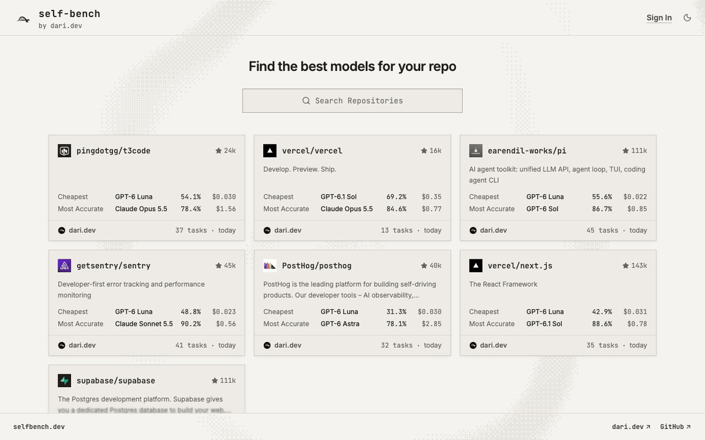
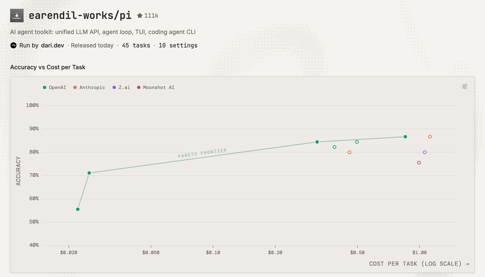

<p align="center">
  <a href="https://selfbench.dev">
    <picture>
      <source media="(prefers-color-scheme: dark)" srcset="review/public/icon-192.png">
      
    </picture>
  </a>
</p>

<h1 align="center">SelfBench</h1>

<p align="center">
  <b>Find the best models for your repo.</b><br>
  Private coding-agent benchmarks built from your repository's own merged pull requests.
</p>

<p align="center">
  <a href="https://selfbench.dev"></a>
  <a href="https://app.selfbench.dev"></a>
</p>

<p align="center">
  <a href="https://github.com/mupt-ai/self-bench/actions/workflows/ci.yml"></a>
  <a href="./LICENSE"></a>
</p>

<p align="center">
  <a href="https://selfbench.dev">
    
  </a>
</p>

Public benchmarks tell you how a model does on someone else's code. SelfBench tells you how it does on yours: it turns your merged PRs into tasks with hidden tests, runs agents and models on them, and plots accuracy against cost.

## Results

Every open-source repository released on **[selfbench.dev](https://selfbench.dev)** gets a live leaderboard: each model, harness, and reasoning setting placed by accuracy and cost per task, with the Pareto frontier drawn through the settings nothing else beats on both.

<p align="center">
  <a href="https://selfbench.dev/earendil-works/pi">
    <picture>
      <source media="(prefers-color-scheme: dark)" srcset="docs/media/results-chart-dark.png">
      
    </picture>
  </a>
  <br>
  <sub><a href="https://selfbench.dev/earendil-works/pi">earendil-works/pi</a> on selfbench.dev, October 2026. The live page has the current numbers.</sub>
</p>

**Browse the leaderboards:** [vercel/next.js](https://selfbench.dev/vercel/next.js) · [supabase/supabase](https://selfbench.dev/supabase/supabase) · [earendil-works/pi](https://selfbench.dev/earendil-works/pi) · [getsentry/sentry](https://selfbench.dev/getsentry/sentry) · [PostHog/posthog](https://selfbench.dev/PostHog/posthog) · [pingdotgg/t3code](https://selfbench.dev/pingdotgg/t3code) · [vercel/vercel](https://selfbench.dev/vercel/vercel) · **[all repositories →](https://selfbench.dev)**

## How it works

For each merged PR, SelfBench rebuilds the task from the commit before the change: the PR's own request becomes the instruction, and an authoring agent writes hidden tests and a reference solution. A task is accepted only if the tests fail without a solution, pass with the original implementation, pass again on a rerun, and survive an independent review. Every accepted task is a native [Harbor](https://harborframework.com/) task.

## Using SelfBench

Everything happens in the web app at [app.selfbench.dev](https://app.selfbench.dev):

1. **Sign in** with GitHub and **connect a repository**.
2. **Batch Generation**: choose how many easy, medium, and hard tasks to build, or use **Add PRs** on the Dataset page to build one task from each pull request you pick. A batch takes hours; it keeps running after you close the page.
3. **Dataset**: inspect each task (instruction, environment, hidden tests, reference patch, pipeline artifacts) and approve or reject it.
4. **Run**: pick models, harnesses, and a sandbox, and run them on the approved tasks.
5. **Results**: compare accuracy against cost, and open any trial's transcript and scores.
6. **Releases**: publish a public repository's results to [selfbench.dev](https://selfbench.dev).

Models and sandboxes run on your organization's own keys under **Credentials**. A deployment can also turn on the managed offering (`SELFBENCH_MANAGED_OFFERING`), which adds model and sandbox access on SelfBench's accounts, billed under **Billing**. **API Keys** gives scripts the same access over the [HTTP API](docs/api.md).

## Self-hosting

SelfBench's reference deployment runs on GCP: Cloud Run for the API and Temporal worker, with optional GKE Autopilot workers for Harbor jobs, plus Cloud SQL and GCS.

1. Provision a GCP project, billing, Terraform state bucket, and GitHub Actions Workload Identity Federation.
2. Configure Terraform inputs and store each runtime secret value in its own Secret Manager secret.
3. Apply the environment with Terraform, or configure the protected GitHub `dev` and `prod` environments to deploy through Actions.
4. Point your domain at the provisioned load balancer and configure GitHub OAuth for the app URL.

For prerequisites, exact Terraform commands, runtime configuration, GitHub Actions setup, and optional GKE workers, see the [self-hosting and infrastructure guide](infra/README.md).

## Development

Requires [Bun](https://bun.sh/) 1.3.14+ and Docker with Compose.

```bash
bun install --frozen-lockfile
bun run validate
```

Run the whole stack (API serving the app, worker, Temporal, Postgres, local Docker sandboxes) from a checkout:

```bash
cp .env.example .env   # GitHub OAuth app, session secret, credential key, managed keys
SELFBENCH_PUBLIC_URL=https://your-tunnel.example docker compose --profile sandbox up -d --build
docker compose port api 8080
```

Compose names the project after the checkout directory and publishes ephemeral host ports, so worktrees run side by side. Set `SELFBENCH_PUBLIC_URL` to the origin the browser opens (a tunnel or reverse proxy) before `up`, and register `<origin>/auth/github/callback` on the OAuth app.

For frontend work, `bun run dev:site` runs the API and Vite with hot reload (secrets in `.env.site`; see `scripts/dev-site.ts`).

## Documentation

- [How it works](docs/how-it-works.md): the pipeline and what makes a task valid
- [HTTP API](docs/api.md)
- [Infrastructure](infra/README.md)

## License

[MIT](LICENSE) © 2026 Mupt AI.
